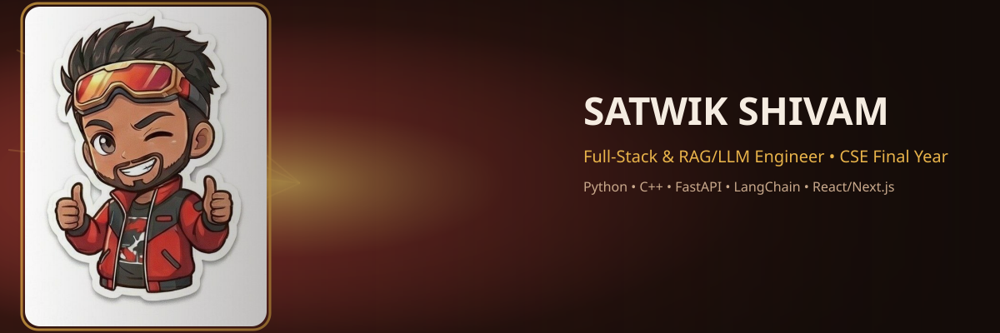

 

  

---

### 🧠 About

I build full-stack and RAG/LLM systems, currently finishing a B.Tech in CSE (grad. June 2027) and navigating campus placements. Flagship project: **CereBRO**, a full-stack RAG-based EdTech platform.

- 🔭 Currently deep in DSA + system design placement prep (TCS, Infosys, Wipro, Cognizant, Accenture)
- 🌱 Exploring cybersecurity fundamentals — PortSwigger Academy, OWASP Top 10
- 🛠️ Stack: Python, C++, React/Next.js, FastAPI, PostgreSQL, LangChain, Docker, Jenkins CI/CD
- 🎓 Google UX Design Professional Certificate · BSNL Telecom Intern
- ✍️ Off the clock: Hindi/Hinglish/English poetry, guitar, Japanese, running

---

### 🚀 Featured Projects

  <picture>
    <source media="(prefers-color-scheme: dark)" srcset="./assets/projects-dark.svg">
    <source media="(prefers-color-scheme: light)" srcset="./assets/projects-light.svg">
    
  </picture>

---

 

  <picture>
    <source media="(prefers-color-scheme: dark)" srcset="https://raw.githubusercontent.com/Satwik99nuts/Satwik99nuts/output/dist/snake-dark.svg">
    <source media="(prefers-color-scheme: light)" srcset="https://raw.githubusercontent.com/Satwik99nuts/Satwik99nuts/output/dist/snake-light.svg">
    
  </picture>

 

  

---

### 📫 Reach me

<!-- swap these placeholders for your real links -->

