<picture>
  <source media="(prefers-color-scheme: dark)" srcset="assets/dark.svg">
  <source media="(prefers-color-scheme: light)" srcset="assets/light.svg">
  
</picture>

 

 

## About

Final-year CS student building **Generative AI systems, RAG pipelines, and computer vision apps** — with production experience shipping via Docker, LangChain, FastAPI, and Next.js. Currently looking for AI/ML or full-stack SWE roles where I can build real, scalable systems, not just notebooks.

- 🔭 Currently building **CereBRO** — an AI-native EdTech platform
- 🌱 Deepening RAG / agentic pipeline design and eval-driven prompt engineering
- 🎓 B.Tech CSE @ C.V. Raman Global University (2023 – 2027)
- 📫 Reach me at **satwikshivam94305@gmail.com**

 

## Tech Stack

  

 

## Featured Projects

<picture>
  <source media="(prefers-color-scheme: dark)" srcset="assets/projects-dark.svg">
  <source media="(prefers-color-scheme: light)" srcset="assets/projects-light.svg">
  
</picture>

 

## GitHub Stats

 

 

## Trophies

 

## Contribution Graph

<picture>
  <source media="(prefers-color-scheme: dark)" srcset="https://raw.githubusercontent.com/Satwik99nuts/Satwik99nuts/output/snake-dark.svg">
  <source media="(prefers-color-scheme: light)" srcset="https://raw.githubusercontent.com/Satwik99nuts/Satwik99nuts/output/snake-light.svg">
  
</picture>

 

